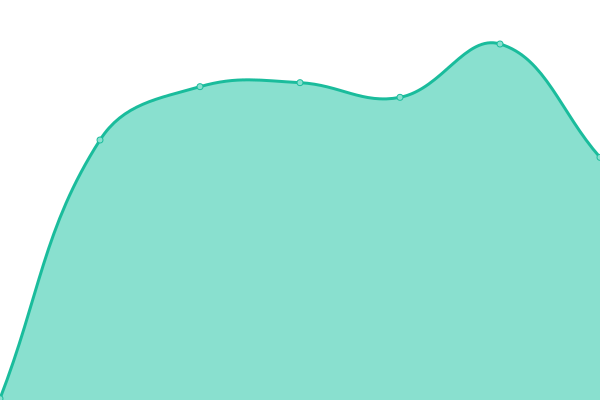

# [📈 Live Status](https://demo.upptime.js.org): <!--live status--> **🟧 Partial outage**

This repository contains the open-source uptime monitor and status page for [xiaoai2022](https://demo.upptime.js.org), powered by [Upptime](https://github.com/upptime/upptime).

With [Upptime](https://upptime.js.org), you can get your own unlimited and free uptime monitor and status page, powered entirely by a GitHub repository. We use [Issues](https://github.com/xiaoai2022/status/issues) as incident reports, [Actions](https://github.com/xiaoai2022/status/actions) as uptime monitors, and [Pages](https://demo.upptime.js.org) for the status page.

<!--start: status pages-->
<!-- This summary is generated by Upptime (https://github.com/upptime/upptime) -->
<!-- Do not edit this manually, your changes will be overwritten -->
<!-- prettier-ignore -->
| URL | Status | History | Response Time | Uptime |
| --- | ------ | ------- | ------------- | ------ |
|  [Personal nextcloud](https://cloud.awa.wiki) | 🟩 Up | [personal-nextcloud.yml](https://github.com/xiaoai2022/status/commits/HEAD/history/personal-nextcloud.yml) | 

 2156ms
     
 | 

<a href="https://status.awa.wiki/history/personal-nextcloud">100.00%</a>
    

|  [ROR2 Server](8.130.34.155) | 🟥 Down | [ror-2-server.yml](https://github.com/xiaoai2022/status/commits/HEAD/history/ror-2-server.yml) | 

 0ms
     
 | 

<a href="https://status.awa.wiki/history/ror-2-server">0.00%</a>
    

|  [Alicloud SC](8.130.34.155) | 🟩 Up | [alicloud-sc.yml](https://github.com/xiaoai2022/status/commits/HEAD/history/alicloud-sc.yml) | 

 225ms
     
 | 

<a href="https://status.awa.wiki/history/alicloud-sc">100.00%</a>
    

|  [Cloudcone SC](173.82.152.200) | 🟩 Up | [cloudcone-sc.yml](https://github.com/xiaoai2022/status/commits/HEAD/history/cloudcone-sc.yml) | 

 53ms
     
 | 

<a href="https://status.awa.wiki/history/cloudcone-sc">100.00%</a>
    

<!--end: status pages-->

[**Visit our status website →**](https://demo.upptime.js.org)

## 📄 License

- Powered by: [Upptime](https://github.com/upptime/upptime)
- Code: [MIT](./LICENSE) © [xiaoai2022](https://demo.upptime.js.org)
- Data in the `./history` directory: [Open Database License](https://opendatacommons.org/licenses/odbl/1-0/)
